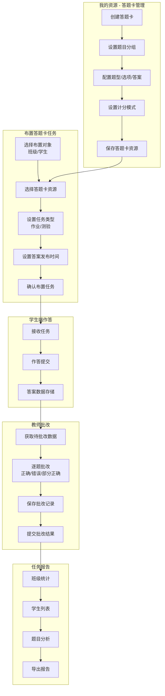

# 银河智学公司 2024年阶段性工作述职报告

**汇报人：** lxx  
**入职时间：** 2024年9月  
**所属项目：** 教师端应用（Teacher App）  
**汇报周期：** 2024年9月 - 2024年12月

---

## 一、个人简介

本人于2024年9月加入银河智学公司，主要负责教师端应用的前端开发工作。入职以来，深度参与了教师端核心业务模块——**答题卡系统**的设计与开发，涵盖资源管理、任务布置、批改评分、报告统计等全链路功能。

---

## 二、核心业务模块：答题卡作业/测验系统

### 2.1 业务模块概述

教师端应用包含两大核心任务类型：
- **作业任务 (TASK_TYPE_HOMEWORK)** - 用于课后作业布置
- **测验任务 (TASK_TYPE_TEST)** - 用于随堂测验和考试

其中，答题卡类型的任务又分为两种评分模式：
- **正确率模式 (isScoreMode=0)** - 仅统计学生答题的正误情况
- **计分模式 (isScoreMode>0)** - 支持题目分值设置、得分统计

### 2.2 业务数据流转架构



---

## 三、核心功能模块详解

### 3.1 答题卡资源管理模块

**技术实现要点：**

1. **数据结构设计**

答题卡采用层级结构设计，支持大题分组和小题明细：

````typescript path=apps/teacher/types/answerSheet/index.ts mode=EXCERPT
export type ScoreMode = {
  isScoreMode: number; // 0 不开启 1 少选得一半 2 少选得n分
  score: number; // 得分模式下，得分
};

export type AnswerSheet = AnswerSheetSummary & {
  resourceList: AnswerSheetResourceItem[];
  questionGroups: AnswerSheetQuestionGroup[];
};
````

2. **计分模式处理逻辑**

支持三种题型（选择、填空、解答），计分模式下支持"少选得一半分"等灵活配置：

````tsx path=apps/teacher/app/answer-sheet/_businessComponent/AnswerSheetContent/QuestionGroup/AnswerSheetSelectScoreEditor/index.tsx mode=EXCERPT
const scoreMode = useWatch<CreateAnswerSheetParams, "scoreMode">({
  name: "scoreMode",
});
const shouldShowScore = useMemo(() => scoreMode.isScoreMode > 0, [scoreMode]);
````

### 3.2 任务布置流程

**布置流程状态机：**
- `select-target` → 选择布置对象（班级/学生）
- `select-answer-sheet` → 选择答题卡资源  
- `set-time` → 设置时间和答案发布策略
- `confirm` → 确认布置

````typescript path=apps/teacher/app/assign/flow/answer-sheet/store/useAssignAnswerSheetForm.ts mode=EXCERPT
const params: AssignAnswerSheetParams = {
  subject: subject.value,
  taskType: taskType.value,
  taskSubType: AssignAnswerSheetSubTypeEnum.ANSWER_SHEET,
  taskName: assignName.value,
  answerSheetId: answerSheetId.value,
  studentGroups: getAnswerSheetStudentGroupsParams().map((item) => ({
    ...item,
    answerPublishTimeType: answerPublishTimeType.value,
  })),
};
````

### 3.3 教师批改模块

**批改流程核心逻辑：**

1. 获取学生作答数据与答题卡结构
2. 将作答详情绑定到题目上方便渲染
3. 支持逐题、逐学生批改
4. 自动保存批改记录（草稿模式）
5. 正式提交批改结果

````tsx path=apps/teacher/app/homework/mark/_sub-page/mark-for-answer-sheet/index.tsx mode=EXCERPT
const { answerSheetDetail, needEvaluationAnswerDetail } =
  useAnswerSheetAndNeedEvaluation(taskId, assignId, {
    onSuccess: ({ answerSheetDetail, needEvaluationAnswerDetail }) => {
      const resultTemp = genQsWithNeedEvaluationAnswerDetails(
        answerSheetDetail,
        needEvaluationAnswerDetail
      );
      // ...
    },
  });
````

### 3.4 报告统计模块

**统计维度：**
- 班级整体完成进度
- 平均正确率/平均得分
- 学生个体表现（得分、用时、正确率）
- 题目维度分析（错题率、答题分布）

````tsx path=apps/teacher/app/homework/_components/task-detail-common/report/index.tsx mode=EXCERPT
const scoreMode = (homeworkData?.detail?.scoreMode || 0) > 0;
const { classProgress, averageAccuracy, avgScore } = computedClassData(
  homeworkData?.detail || null,
  evaluationDetailMap,
  isAnswerSheet,
  scoreMode
);
````

---

## 四、技术亮点与创新

### 4.1 派生值模式解决异步数据问题
针对 React useState 初始值只在首次渲染生效的问题，采用"派生值模式"：
```typescript
const [userSelected, setUserSelected] = useState<T | null>(null);
const selected = userSelected ?? defaultValue;
```

### 4.2 批改记录本地缓存
实现批改进度自动记忆，用户下次进入时恢复到上次批改位置：
```typescript
localStorage.setItem(
  `homework_mark_record_${userInfo?.userID}_${taskId}_${assignId}`,
  JSON.stringify(newCreateRecord)
);
```

### 4.3 表单联动校验
计分模式变更时自动触发相关字段校验：
```typescript
if (scoreMode.isScoreMode !== values.scoreMode.isScoreMode) {
  setTimeout(() => {
    trigger(`questionGroups.${i}.questions.${j}.answerDetail.${k}.score`);
  }, 0);
}
```

---

## 五、工作成果总结

| 需求版本 | 需求名称 | 主要功能点 | 状态 |
|---------|---------|-----------|------|
| v1.3 | 我的资源_答题卡 | 答题卡创建/编辑/预览/复用 | ✅ 已完成 |
| v1.3 | 布置答题卡作业/测验 | 任务布置流程、对象选择、时间设置 | ✅ 已完成 |
| v1.4 | 答题卡2期（计分模式） | 分值设置、少选得分、得分统计 | ✅ 已完成 |

---

## 六、个人成长与展望

### 6.1 业务理解深化
- 深入理解K12教育场景下作业/测验的完整业务流程
- 掌握答题卡系统从创建到报告的全链路数据流转

### 6.2 技术能力提升
- React Hook Form + Zod 表单校验体系
- SWR 数据获取与缓存策略
- Next.js App Router 最佳实践
- Preact Signals 状态管理

### 6.3 后续规划
- 持续优化批改体验，提升教师操作效率
- 参与更多核心业务模块开发
- 推动组件库建设和代码规范落地

---

**汇报完毕，感谢各位领导审阅！**
