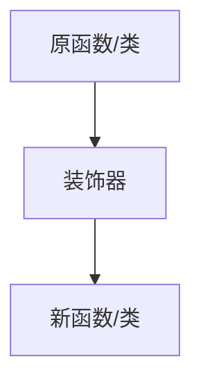

装饰器（decorator）是中的一种高级功能，是 Python 的一种程序设计模式，装饰器本质上是一个 函数或类。

它可以让其他函数或类，在不需要做任何代码修改的前提下增加额外功能，装饰器的返回值也是一个函数或类对象。

有了装饰器，就可以抽离与函数功能本身无关的代码，放到装饰器中并继续重复使用！



{/* 装饰器的语法使用 `@装饰器名` 来应用在函数或方法上。 */}

## 定义与使用

```py
# 定义一个装饰器
def my_decorator(func):
    def wrapper():
        print("在原函数之前做一些操作")
        func()
        print("在原函数之后做一些操作")
    return wrapper

# 使用装饰器
@my_decorator
def my_fun():
    print("这是原函数")

my_fun()

# 执行后输出如下：
# 在原函数之前做一些操作
# 这是原函数
# 在原函数之后做一些操作
```
- my_decorator 是装饰器，它接收一个函数作为参数。
- wrapper 是内部函数，它是实际会被调用的新函数，它包裹了原始函数的调用，并在其前后增加了额外的行为。
- Python 会自动将 my_fun 作为参数传递给 my_decorator，然后将返回的 wrapper 函数替换掉原来的 my_fun。


## 带参数

若目标函数需参数，可在装饰器的 wrapper 函数中传递

```python
def my_decorator(func):
    def wrapper(*args, **kwargs):
        print("在原函数之前做一些操作")
        func(*args, **kwargs)
        print("在原函数之后做一些操作")
    return wrapper

@my_decorator
def say_hello(msg):
    print(msg)

say_hello("Hello, World!")

# 执行后输出如下：
# Hello, World!
```

装饰器本身也可以接受参数，此时需要额外定义一个外层函数（既装饰器工厂）来接收这些参数，并返回一个装饰器函数（🪆 套娃么）。

```py
def repeat(num):
    def decorator(func):
        def wrapper(*args, **kwargs):
            for _ in range(num):
                func(*args, **kwargs)
        return wrapper
    return decorator

@repeat(2)
def say_hello(msg):
    print(msg)

say_hello("Hello, World!")

# 执行后输出如下：
# Hello, World!
# Hello, World!
```

## 分类
按照装饰器的**应用目标**，可以分为函数装饰器和类装饰器。  
当给类使用的时候 装饰器用于动态修改类行为，它接收一个类作为参数，并返回一个新的类或修改后的类，类装饰器可以有一下功能：
- 添加/修改类的方法或属性
- 拦截实例化过程
- 实现单例模式、日志记录、权限检查等功能


另外按照装饰器本身定义的方式，可以分为函数形式和类形式。

<Tabs>

  <Tab title="例子 1">
  ```py
    # 定义一个类装饰器函数
    # 本例子用于演示类装饰器的 添加/修改类的方法或属性 功能
    def logger(cls):
        class Wrapper:
            def __init__(self, *args, **kwargs):
                self.wrapped = cls(*args, **kwargs)  # 实例化原始类

            # 扩展被修饰类的功能
            def hi_logger(self):
                print(f"我是logger装饰器，我现已被应用到 {cls.__name__} 类上")

            # 代理原始类的方法
            def display(self):
                print(f"调用 {cls.__name__}.display() 前")
                self.wrapped.display()
                print(f"调用 {cls.__name__}.display() 后")

        return Wrapper  # 返回包装后的类

    # 使用类装饰器
    @logger
    class Calculator:
        def display(self):
            print("这是 Calculator 的 display 方法")

    obj = Calculator()
    obj.hi_logger()
    obj.display()
    ```
  </Tab>

  <Tab title="例子 2">
    ```py
    class Logger:
        def __init__(self, func):
            self.func = func  # 保存被装饰的函数

        def __call__(self, *args):
            print(f"调用函数: {self.func.__name__}")
            return self.func(*args)

    # 应用到函数上
    @Logger
    def say_hello(name):
        print(f"Hello, {name}!")

    say_hello("小明")
    ```
  </Tab>

  <Tab title="例子 3">
    ```py
    class SingletonDecorator:
        def __init__(self, cls):
            self.cls = cls
            self.instance = None

        # __call__为 python 的特殊方法，用于定义对象的可调用行为
        def __call__(self, *args, **kwargs):
            if self.instance is None:
                self.instance = self.cls(*args, **kwargs)
            return self.instance

    # 应用到类上
    @SingletonDecorator
    class Database:
        def __init__(self):
            print("Database 初始化")

    db1 = Database()
    db2 = Database()
    print(db1 is db2)  # True，说明是同一个实例
    ```
  </Tab>
</Tabs>


## 堆叠使用

你可以将多个装饰器堆叠在一起，它们会按照从下到上的顺序依次应用

```py
def decorator1(func):
    def wrapper():
        print("Decorator 1")
        func()
    return wrapper

def decorator2(func):
    def wrapper():
        print("Decorator 2")
        func()
    return wrapper

@decorator1
@decorator2
def say_hello():
    print("Hello!")

say_hello()
```

## 内置

Python 提供了一些内置的装饰器，例如：

- @staticmethod: 将方法定义为静态方法，不需要实例化类即可调用。
- @classmethod: 将方法定义为类方法，第一个参数是类本身（通常命名为 cls）。
- @property: 将方法转换为属性，使其可以像属性一样访问。

## 其它

我们经常看到 `@xxx.xx` 形式的装饰器，实际上是属性访问的结果，可以分为几种情况：·
这种 `@xxx.xx` 形式的装饰器实际上都是**属性访问**的结果

<Tabs>

  <Tab title="模块中的函数/类作为装饰器">
    ```python
    # module_decorators.py
    class Logger:
        @staticmethod
        def log_calls(func):
            def wrapper(*args, **kwargs):
                print(f"Calling {func.__name__}")
                return func(*args, **kwargs)
            return wrapper

        @classmethod
        def time_it(cls, func):
            import time
            def wrapper(*args, **kwargs):
                start = time.time()
                result = func(*args, **kwargs)
                print(f"Execution time: {time.time() - start:.4f}s")
                return result
            return wrapper

    # 另一个文件使用
    import module_decorators

    @module_decorators.Logger.log_calls
    def my_func():
        pass

    @module_decorators.Logger.time_it
    def another_func():
        pass
    ```
  </Tab>

  <Tab title="实例的方法作为装饰器">
    ```python
    class DecoratorFactory:
        def __init__(self, prefix="LOG"):
            self.prefix = prefix

        def decorator(self, func):
            def wrapper(*args, **kwargs):
                print(f"[{self.prefix}] {func.__name__} called")
                return func(*args, **kwargs)
            return wrapper

    # 创建实例
    factory = DecoratorFactory("DEBUG")

    # 使用实例方法作为装饰器
    @factory.decorator
    def test_function():
        print("Function executed")

    test_function()  # 输出: test_function called \n Function executed
    ```
  </Tab>

  <Tab title="类的属性作为装饰器">
    ```python
    class Registry:
        """装饰器注册表"""

        # 类属性本身就是装饰器
        registered = {}

        @classmethod
        def register(cls, name):
            """返回装饰器函数"""
            def decorator(func):
                cls.registered[name] = func
                return func
            return decorator

        @classmethod
        def api(cls, version="v1"):
            """带参数的装饰器"""
            def decorator(func):
                func.api_version = version
                func.is_api = True
                return func
            return decorator

    # 使用
    @Registry.register("user_login")
    @Registry.api("v2")
    def login():
        return "Login endpoint"

    print(Registry.registered)  # {'user_login': <function login>}
    print(login.api_version)    # v2
    ```
  </Tab>
</Tabs>
