装饰器（decorators）是 Python 中的一种高级功能，它允许你动态地修改函数或类的行为。
装饰器本质就是一个函数，它接受一个函数作为参数，并返回一个新的函数或修改原来的函数：Python 装饰允许在不修改原有函数代码的基础上，动态地增加或修改函数的功能，装饰器本质上是一个接收函数作为输入并返回一个新的包装过后的函数的对象。

```mermaid
graph TD
    A[原函数] --> B[装饰器（函数）] --> C[新函数]
```




装饰器的语法使用 `@装饰器名` 来应用在函数或方法上。


## 入门例子
我们来创建一个装饰器吧

```python
def my_decorator(func):
    def wrapper():
        print("在原函数之前做一些操作")
        func()
        print("在原函数之后做一些操作")
    return wrapper
```
my_decorator 是一个装饰器函数，它接受一个函数 func 作为参数，并返回一个内部函数 wrapper，在 wrapper 函数内部，你可以执行一些额外的操作，然后调用原始函数 func，并返回其结果。
* my_decorator 是装饰器，它接收一个函数 original_function 作为参数。
* wrapper 是内部函数，它是实际会被调用的新函数，它包裹了原始函数的调用，并在其前后增加了额外的行为。
* 当我们使用 @my_decorator 前缀在 xx_function 定义前，Python会自动将 xx_function 作为参数传递给 my_decorator，然后将返回的 wrapper 函数替换掉原来的 xx_function。


如下即可使用装饰器
```python
@my_decorator
def say_hello():
    print("Hello!")

say_hello()

# 执行后输出如下：
# 在原函数之前做一些操作
# Hello!
# 在原函数之后做一些操作
```

## 带参数的装饰器
如果原函数需要参数，可以在装饰器的 wrapper 函数中传递参数（如下例子输出结果和上边一样）
```python
def my_decorator(func):
    def wrapper(*args, **kwargs):
        print("在原函数之前做一些操作")
        func(*args, **kwargs)
        print("在原函数之后做一些操作")
    return wrapper

@my_decorator
def say_hello(msg):
    print(msg)

say_hello("Hello, World!")
```


装饰器本身也可以接受参数，此时需要额外定义一个外层函数（既装饰器工厂）来接收这些参数，并返回一个装饰器函数（🪆套娃么）。
```py
def repeat(num):
    def decorator(func):
        def wrapper(*args, **kwargs):
            for _ in range(num):
                func(*args, **kwargs)
        return wrapper
    return decorator

@repeat(2)
def say_hello(msg):
    print(msg)

say_hello("Hello, World!")

# 执行后输出如下：
# Hello, World!
# Hello, World!
```


## 装饰器分类

除了上边入门例子函数装饰器外，Python 还支持给类使用的装饰器。   
类装饰器用于动态修改类行为，它接收一个类作为参数，并返回一个新的类或修改后的类，类装饰器可以有一下功能：
* 添加/修改类的方法或属性
* 拦截实例化过程
* 实现单例模式、日志记录、权限检查等功能


## 装饰器定义
装饰器有两种常见定义形式：
* 函数形式的类装饰器（接收类作为参数，返回新类）
* 类形式的类装饰器（实现 __call__ 方法，使其可调用）

这两种不同形式的定义都可以应用到类或函数上！


###  函数形式
应用到函数上的例子在上边提到了，这里是应用到类上
```py
# 定义一个类装饰器函数（本例子用于演示类装饰器的 添加/修改类的方法或属性 功能）
def logger(cls):
    class Wrapper:
        def __init__(self, *args, **kwargs):
            self.wrapped = cls(*args, **kwargs)  # 实例化原始类
       
        # 扩展被修饰类的功能
        def hi_logger(self):
            print(f"你好，我是logger装饰器, 我现在已被应用到了 {cls.__name__} 类上")

        # 代理原始类的方法
        def display(self):
            print(f"调用 {cls.__name__}.display() 前")
            self.wrapped.display()
            print(f"调用 {cls.__name__}.display() 后")
   
    return Wrapper  # 返回包装后的类

# 使用类装饰器
@logger
class Calculator:
    def display(self):
        print("这是 Calculator 的 display 方法")

obj = Calculator()
obj.hi_logger()
obj.display()
```

###  类形式
应用到函数上
```py
class Logger:
    def __init__(self, func):
        self.func = func  # 保存被装饰的函数
    
    def __call__(self, *args):
        print(f"调用函数: {self.func.__name__}")
        return self.func(*args)

@Logger
def say_hello(name):
    print(f"Hello, {name}!")

say_hello("小明")
```

应用到类上
```py
class SingletonDecorator:
    def __init__(self, cls):
        self.cls = cls
        self.instance = None
   
    # __call__为 python 的特殊方法，用于定义对象的可调用行为
    def __call__(self, *args, **kwargs): 
        if self.instance is None:
            self.instance = self.cls(*args, **kwargs)
        return self.instance

@SingletonDecorator
class Database:
    def __init__(self):
        print("Database 初始化")

db1 = Database()
db2 = Database()
print(db1 is db2)  # True，说明是同一个实例
```

## 多个装饰器的堆叠使用
你可以将多个装饰器堆叠在一起，它们会按照从下到上的顺序依次应用
```py
def decorator1(func):
    def wrapper():
        print("Decorator 1")
        func()
    return wrapper

def decorator2(func):
    def wrapper():
        print("Decorator 2")
        func()
    return wrapper

@decorator1
@decorator2
def say_hello():
    print("Hello!")

say_hello()
```

## 内置装饰器
Python 提供了一些内置的装饰器，例如：
* @staticmethod: 将方法定义为静态方法，不需要实例化类即可调用。
* @classmethod: 将方法定义为类方法，第一个参数是类本身（通常命名为 cls）。
* @property: 将方法转换为属性，使其可以像属性一样访问。


## 命名空间
种 @xxx.xx 形式的装饰器实际上是属性访问的结果，可以分为几种情况
这种 `@xxx.xx` 形式的装饰器实际上都是**属性访问**的结果

### 模块中的函数/类作为装饰器

```python
# module_decorators.py
class Logger:
    @staticmethod
    def log_calls(func):
        def wrapper(*args, **kwargs):
            print(f"Calling {func.__name__}")
            return func(*args, **kwargs)
        return wrapper

    @classmethod
    def time_it(cls, func):
        import time
        def wrapper(*args, **kwargs):
            start = time.time()
            result = func(*args, **kwargs)
            print(f"Execution time: {time.time() - start:.4f}s")
            return result
        return wrapper

# 另一个文件使用
import module_decorators

@module_decorators.Logger.log_calls
def my_func():
    pass

@module_decorators.Logger.time_it
def another_func():
    pass
```

### 实例的方法作为装饰器

```python
class DecoratorFactory:
    def __init__(self, prefix="LOG"):
        self.prefix = prefix
    
    def decorator(self, func):
        def wrapper(*args, **kwargs):
            print(f"[{self.prefix}] {func.__name__} called")
            return func(*args, **kwargs)
        return wrapper

# 创建实例
factory = DecoratorFactory("DEBUG")

# 使用实例方法作为装饰器
@factory.decorator
def test_function():
    print("Function executed")

test_function()  # 输出: [DEBUG] test_function called \n Function executed
```

### 类的属性作为装饰器

```python
class Registry:
    """装饰器注册表"""
    
    # 类属性本身就是装饰器
    registered = {}
    
    @classmethod
    def register(cls, name):
        """返回装饰器函数"""
        def decorator(func):
            cls.registered[name] = func
            return func
        return decorator
    
    @classmethod
    def api(cls, version="v1"):
        """带参数的装饰器"""
        def decorator(func):
            func.api_version = version
            func.is_api = True
            return func
        return decorator

# 使用
@Registry.register("user_login")
@Registry.api("v2")
def login():
    return "Login endpoint"

print(Registry.registered)  # {'user_login': <function login>}
print(login.api_version)    # v2
```
