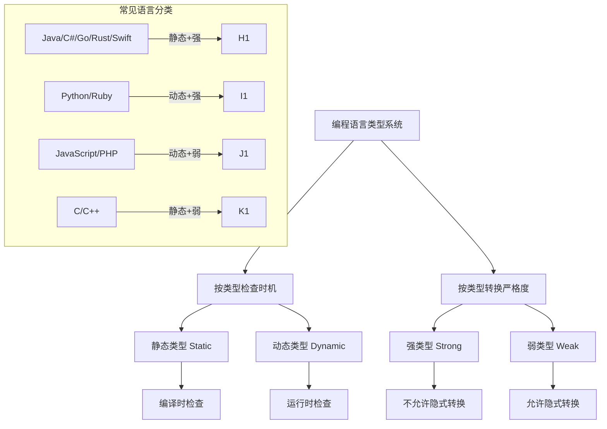

## 一、核心概念区分

### 1. **动态类型 vs 静态类型**
**区分标准**：**类型检查发生的时间**
- **静态类型语言**：在**编译期**进行类型检查
  - 变量类型在声明时确定，不能改变
  - 示例：Java, C++, C#, Go, Rust
  ```java
  // Java示例 - 编译时确定类型
  String name = "张三";  // 编译时就知道name是String类型
  // name = 123;  // 编译错误！不能将int赋给String
  ```

- **动态类型语言**：在**运行期**进行类型检查
  - 变量类型在运行时确定，可以改变
  - 示例：Python, JavaScript, Ruby, PHP
  ```python
  # Python示例 - 运行时确定类型
  x = "hello"  # 现在是字符串
  x = 42       # 现在变成整数，完全合法！
  ```

### 2. **强类型 vs 弱类型**
**区分标准**：**类型转换的严格程度**
- **强类型语言**：**不允许隐式类型转换**
  - 不同类型操作需要显式转换
  - 示例：Python, Java, Go
  ```python
  # Python（强类型）
  "100" + 50  # 错误！TypeError: must be str, not int
  str(50) + "100"  # 正确：需要显式转换
  ```

- **弱类型语言**：**允许隐式类型转换**
  - 自动进行类型转换，可能导致意外行为
  - 示例：JavaScript, PHP, C
  ```javascript
  // JavaScript（弱类型）
  "100" + 50  // "10050" - 数字被隐式转换为字符串
  "100" - 50  // 50 - 字符串被隐式转换为数字
  ```

## 二、分类关系图



## 三、四象限分类示例

| | **强类型** | **弱类型** |
|-----------|-----------|-----------|
| **静态类型** | Java, C#, Go, Rust, Swift | C, C++ |
| **动态类型** | Python, Ruby, TypeScript | JavaScript, PHP, Perl |

### 各象限特点：
1. **静态+强型**（左上）：最严格，最安全
   - 编译时发现类型错误
   - 无隐式转换陷阱
   - 适合大型项目、团队协作

2. **静态+弱型**（右上）：灵活但有风险
   - C语言：`int x = "hello";` 可能只是警告
   - 需要程序员自己注意类型安全

3. **动态+强型**（左下）：灵活而安全
   - Python：运行时会检查类型，但不允许隐式转换
   - 开发快速，运行时可能发现类型错误

4. **动态+弱型**（右下）：最灵活，最容易出错
   - JavaScript：`"2" * "3"` → 6，`"2" + "3"` → "23"
   - 需要特别注意类型转换规则

## 四、实际影响对比

### 开发体验：
```javascript
// JavaScript（动态弱类型）- 灵活但有坑
let result = "5" - 3;     // 2 (自动转换)
let result2 = "5" + 3;    // "53" (自动转换)
let result3 = "hello" - 1; // NaN (静默失败)
```

```python
# Python（动态强类型）- 错误更明确
result = "5" - 3     # TypeError 立即报错
result = int("5") - 3  # 2 必须显式转换
```

### 类型安全对比：
```java
// Java（静态强类型）- 编译期保护
List<String> list = new ArrayList<>();
list.add("text");
// list.add(123);  // 编译错误！
String item = list.get(0);  // 安全，肯定是String
```

## 五、现代趋势

1. **类型注解流行**：
   - Python 3.5+：类型提示
   - JavaScript → TypeScript（静态类型超集）
   ```python
   # Python类型提示
   def greet(name: str) -> str:
       return f"Hello, {name}"
   ```

2. **渐进式类型**：
   - TypeScript、Python可选类型
   - 从小项目开始，逐渐增加类型约束

## 六、选择建议

| 场景 | 推荐类型 | 理由 |
|------|---------|------|
| 大型企业项目 | 静态强类型 | 维护性、可读性、安全性 |
| 快速原型/脚本 | 动态类型 | 开发速度快 |
| Web前端 | JavaScript/TypeScript | 生态丰富 |
| 系统编程 | 静态类型 | 性能、安全性 |
| 数据科学 | Python | 库丰富，开发快速 |

**核心要点**：
- **静态/动态**决定何时发现类型错误（编译时 vs 运行时）
- **强/弱类型**决定类型转换是否自动发生
- 现代开发常混合使用：用TypeScript增强JavaScript，用类型提示增强Python


## 七、强类型的"安全隐式转换"
🥵 但是我感觉强类型也有隐式转换的特点呀？

你的感觉是对的！这是一个常见的理解误区。实际上，**强类型语言也存在隐式转换**，但关键区别在于**转换的安全性和限制**。

让我用具体例子澄清这个重要区别：

强类型语言允许**某些安全的、不丢失信息的隐式转换**，但**禁止可能导致问题的隐式转换**。

示例对比：

```python
# Python（强类型）- 允许"向上转换"
x = 10      # int
y = 3.14    # float
result = x + y  # ✅ 允许：int → float (不丢失信息)
print(result)   # 13.14

# 但不允许可能出问题的转换
s = "100"
# n = s + 50  # ❌ TypeError: 必须显式转换
n = int(s) + 50  # ✅ 必须显式转换
```

```javascript
// JavaScript（弱类型）- 几乎什么都允许转换
console.log("5" - 3);      // 2 (字符串→数字)
console.log("5" + 3);      // "53" (数字→字符串)
console.log(true + false); // 1 (布尔→数字)
console.log([] + {});      // "[object Object]" 
console.log({} + []);      // 0 (令人困惑！)
```

## 八、强类型语言的隐式转换规则

强类型语言通常遵循这些原则：

### 1. **允许窄类型→宽类型（安全提升）**
```java
// Java示例
int i = 100;
double d = i;  // ✅ int → double (安全，不丢失精度)
long l = i;    // ✅ int → long (安全)

// float f = 3.14;  // ❌ double → float 需要显式转换（可能丢失精度）
float f = (float)3.14;  // ✅ 必须显式
```

### 2. **禁止宽类型→窄类型（需要显式）**
```java
double d = 3.14;
// int i = d;  // ❌ 编译错误！可能丢失小数部分
int i = (int)d;  // ✅ 必须显式转换
```

### 3. **禁止不相关类型转换**
```python
# Python
# "123" → 123  ❌ 不能隐式转换
# 123 → "123"  ❌ 不能隐式转换
# True → 1     ❌ 不能隐式转换
```

## 九、真正的区别是"隐式转换的范围和安全性"

让我用一个更准确的分类：

### **弱类型语言**：执行"**上下文推断转换**"
- 根据操作符和上下文**猜测**你的意图
- 可能产生意外结果
```javascript
// JavaScript的"神奇"转换
console.log([] == ![]);  // true - 令人困惑！
console.log(null == undefined);  // true
console.log("0" == false);  // true
```

### **强类型语言**：执行"**类型安全提升**"
- 只允许明确安全的转换（通常向上转换）
- 保持类型一致性
```java
// Java的类型安全转换
byte b = 100;
short s = b;    // ✅ byte → short (安全)
int i = s;      // ✅ short → int (安全)
long l = i;     // ✅ int → long (安全)
float f = l;    // ✅ long → float (安全，可能损失精度但允许)
double d = f;   // ✅ float → double (安全)

// char c = b;  // ❌ byte → char 不安全
```

## 十、重新定义理解

更准确的说法应该是：

| 特性 | 强类型语言 | 弱类型语言 |
|------|-----------|-----------|
| **隐式转换原则** | 类型安全提升 | 上下文推断转换 |
| **转换范围** | 有限的、可预测的 | 广泛的、有时意外的 |
| **数值转换** | 允许安全的数值提升 | 允许任何数值转换 |
| **字符串转换** | 几乎不允许隐式 | 频繁自动转换 |
| **布尔转换** | 通常不允许隐式 | 各种真值转换 |
| **对象转换** | 严格的类型层次 | ToPrimitive等复杂规则 |

## 十一、实际的连续性光谱

实际上，语言在强弱类型上是一个连续光谱：

```
最弱类型 ←─────────────────────────────→ 最强类型
PHP      JavaScript     C++        Java       Python      Haskell
         TypeScript     C#         Go         Rust
```

**Python其实比Java更"强"**：
```python
# Python - 几乎不允许任何隐式转换
1 + 2.0        # ✅ int → float (仅有的几种安全转换之一)
"Age: " + 42   # ❌ TypeError! 必须显式转换
True + 1       # ❌ TypeError!
```

```javascript
// JavaScript - 各种隐式转换
"Age: " + 42     // ✅ "Age: 42"
true + 1         // ✅ 2
"5" * "3"        // ✅ 15
[1, 2] + [3, 4]  // ✅ "1,23,4"
```

## 十二、总结澄清

你的感觉是对的，但需要精确化：

1. **所有主流语言都有某种形式的隐式转换**
2. **关键区别在于**：
   - **弱类型**：根据操作符**改变转换规则**（`+` vs `-`）
   - **强类型**：转换规则**基于类型安全性**，与操作符无关

3. **更实用的判断方法**：
```javascript
// 如果这些都能工作，可能是弱类型：
"123" == 123          // 比较时自动转换
"5" * "3" == 15       // 操作时自动转换
if ("hello") {...}    // 非空字符串为真
0 == false            // 数字和布尔比较
```

```python
# 如果这些都不行，就是强类型：
# "123" == 123        # False (类型不同)
# "5" * "3"           # TypeError
# if "hello": ...     # ✅ 但这在Python可以！(Python有真值概念)
# 0 == False          # False (但 0 == 0, True == 1)
```

**最终建议**：不要纠结于绝对分类，而是理解每种语言的**类型转换哲学**：
- 弱类型："我会尽量理解你的意思，即使这可能产生意外"
- 强类型："我会确保类型安全，除非你明确告诉我怎么做"
